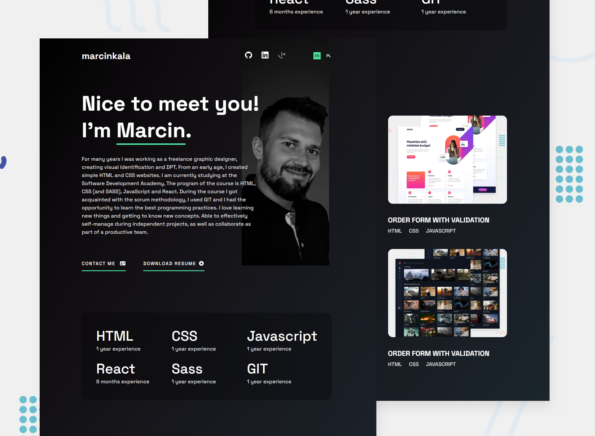

## Overview

### The challenge

Users should be able to:

- Receive an error message when the `form` is submitted if:
  - Any field is empty
  - The email address is not formatted correctly
- View the optimal layout for the interface depending on their device's screen size
- See hover and focus states for all interactive elements on the page
- Send email via emailjs service

### Links

- Live Site URL: [Portfolio](https://portfolio-mk-react.netlify.app/)

## My process

### Built with

- Semantic HTML5 markup
- CSS custom properties
- Flexbox
- CSS Grid
- [EmailJS](https://www.emailjs.com/)
- [React](https://reactjs.org/) - JS library

## Setup

To run this project, clone it and install it locally using npm:

```
$ git clone git@github.com:kalamarcin/portfolio_react.git
$ cd portfolio_react
$ npm install

$ npm start

```

## Author

- Website - [Add your name here](https://www.your-site.com)
